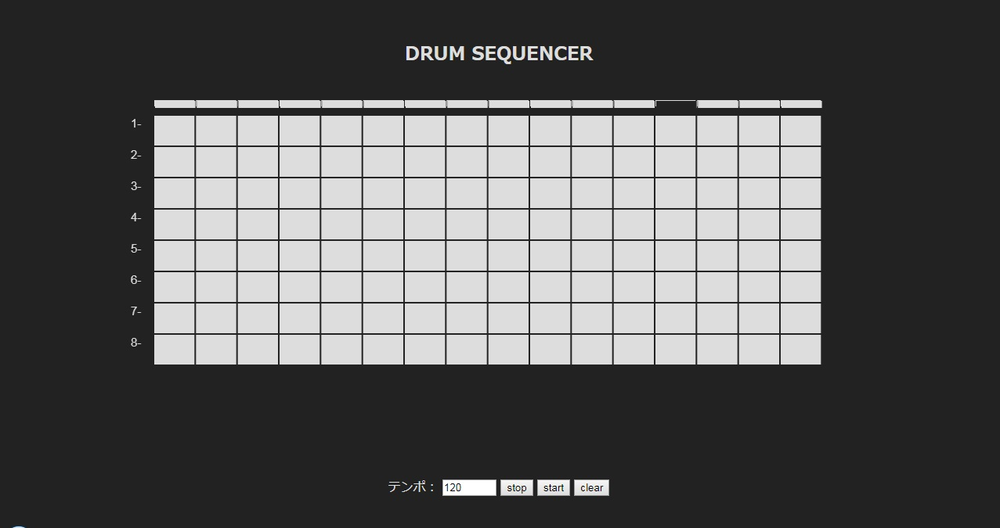

# DrumSequencer
- These programs use Web Audio API and Web MIDI API

- You can play to accsess as below. 
https://mikatahara.github.io/DrumSequencer/

 

 

- 8 lines x 32 culumns are displayed.
- Each lines, following instruments are assigned.
-- BD. Bass Drum
-- SN. Snare
-- LT. Low Floor Tom
-- HT. High Floor Tom
-- CH. Closed Hi-Hat
-- PH. Pedal Hi-Hat
-- OH. Open Hi-Hat
-- CC. Crash Cymbal
